### COM3504 Project 

## Running The System
To install the necesasry npm modules, please navigate to the project directory in the terminal/console and use `npm install`. This will install all npm modules needed.

Make sure that MongoDB is running with the appropriate command. of OSX systems this will be 
```
sudo mongod --dbpath /System/Volumes/Data/data/db --port 27017
```

Once MongoDB is running, open the project in IntelliJ and run it. This will launch the project servers for use. 

Navigate to `https:///localhost:3000` to see the main page (assuming you have set up Chrome to allow unsecure hosts).

## Uploading Mock Data
To upload mock data in JSON format, navigate to `https://localhost:3000/mock_data`. Once on this page, select the `add` button in the header (shown as a plus symbol), select the JSON file, and click upload. Once uploaded, you can navigate back to the index page by selecting the cancel button at the top right of the page (shown as a cross symbol). 

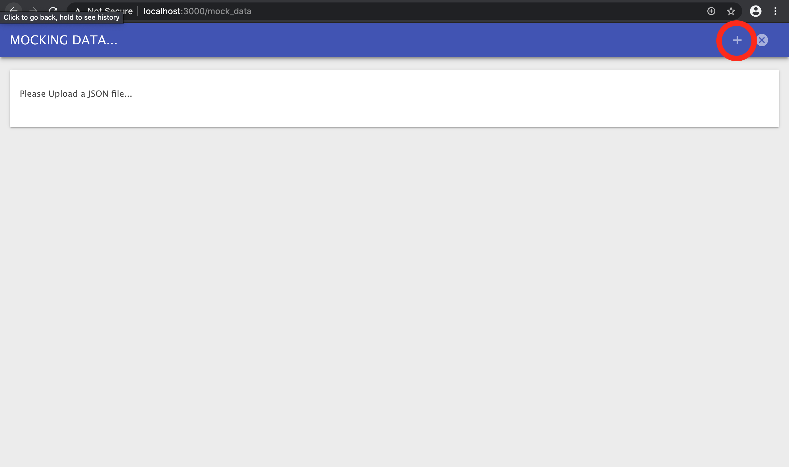 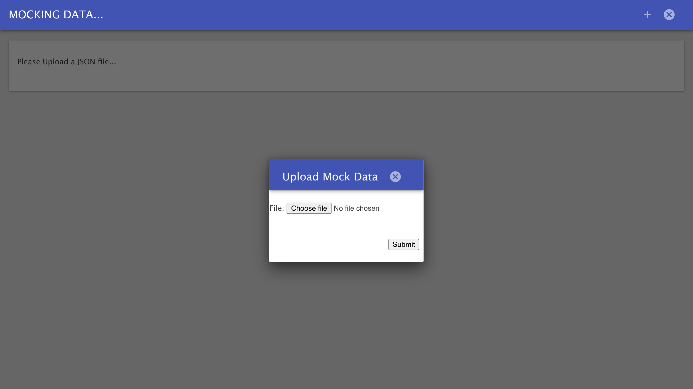

(Above left): the mock data page. (Above Right): the mock data upload pop-up

## Logging in and Registering
To login, click the login button in the page header (shown as an arrow pointing to a door). This will take you to the login page. To login, fill in your email address and password. Once logged in you will be redirected back to the index page.

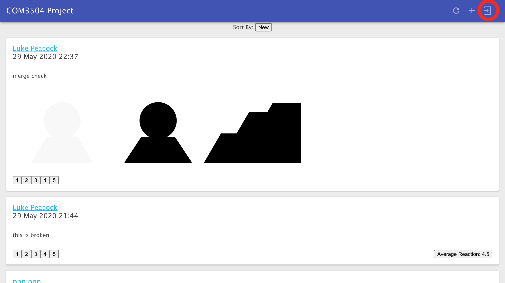 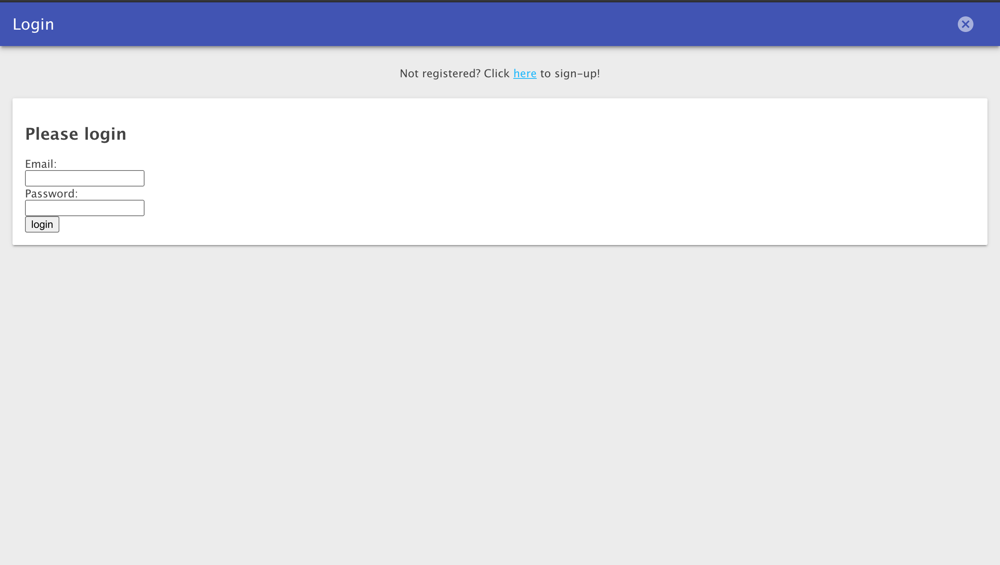

(Above left): the login button. (Above right): the login apge

In order to register please navigate to the login page and click the link to the register page. Fill in the details and hit register. You will be logged in and redirected to the index page.

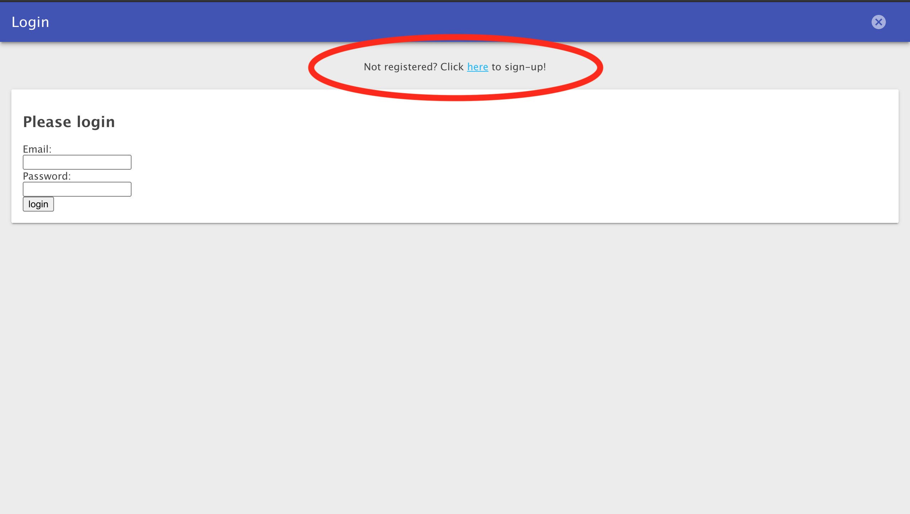 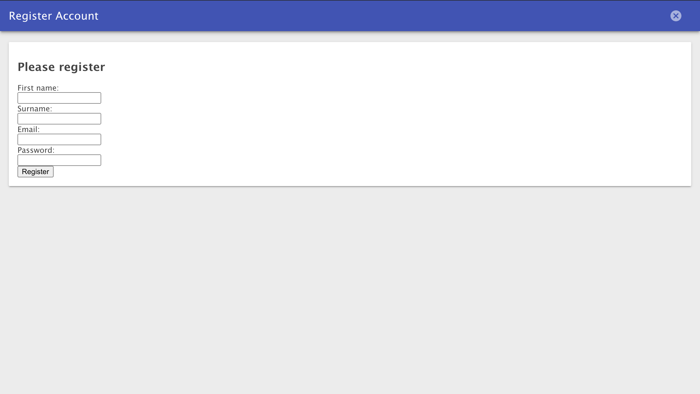

(Above left): The registration button, on the login page. (Above Right): The registration page

## Posting a Story
To post a story, click the add button on the index page or any user profile page (shown as a plus symbol). Fill in the content field and select up to 3 images to add. Then hit submit. This will process and upload the story. You should see it appear at the top of the stories list on the page.

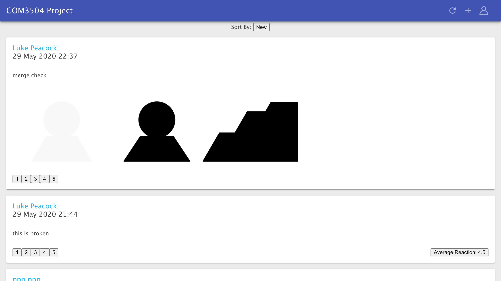 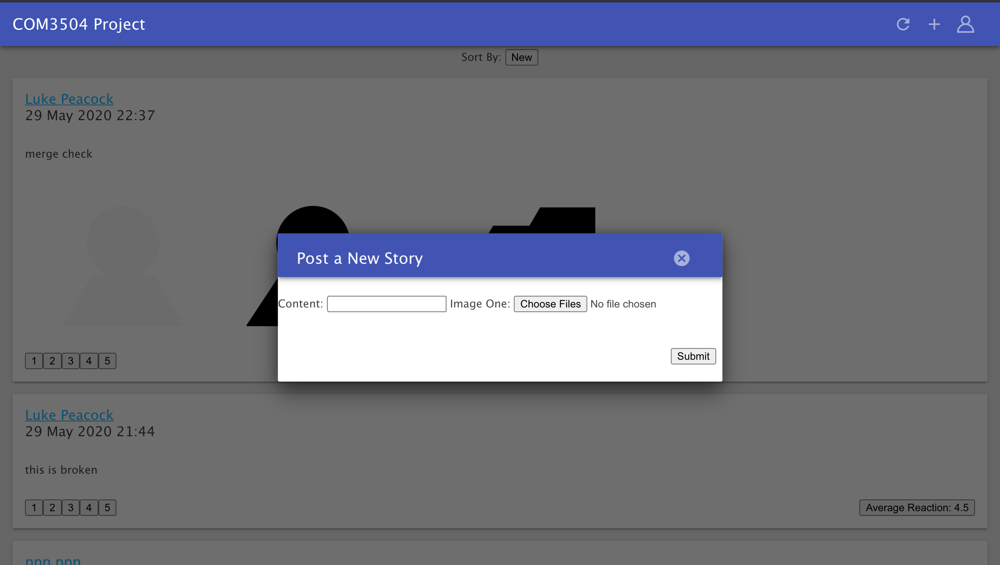

(Above left): The post story button. (Above Right): The post-story pop-up. (Bottom left): An example story before posting. (Bottom right): An example story after posting.

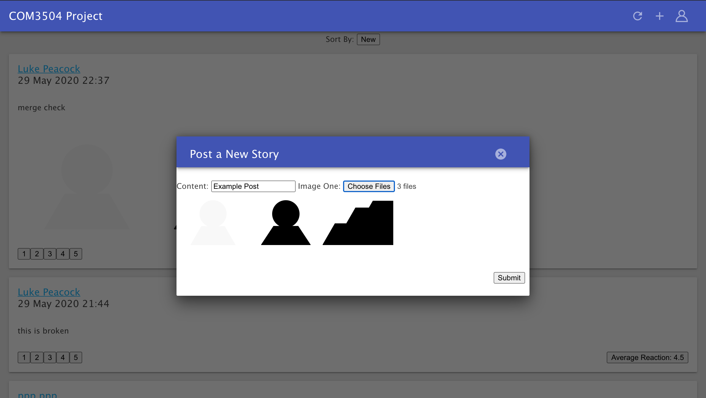 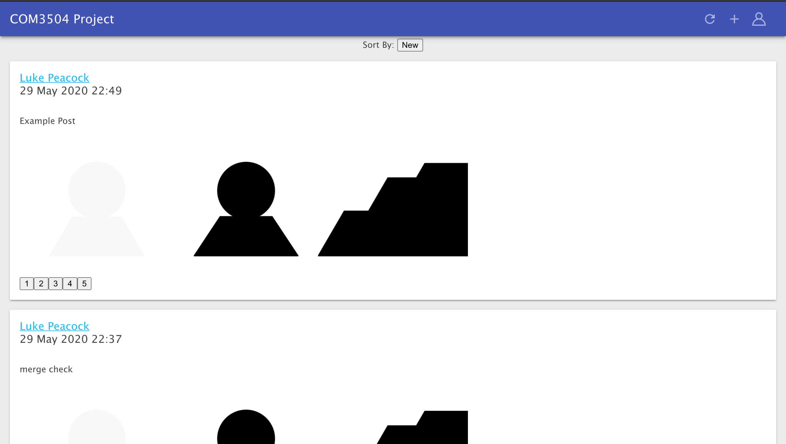

## Reacting to Story
To react to a story, select a reaction (1 to 5) from the reactions buttons located beneath the story. This will submit the reaction.


(Above): The reaction buttons

## Seeing Stories, Reactions, and Users
To view stories navigate to the index page or any user profile. The index page will show all stories based on either newest first, or a recommender algorithm (not finished). User profiles will show a user's stories with newest first. To view a user profile, click their name on any story they have posted.

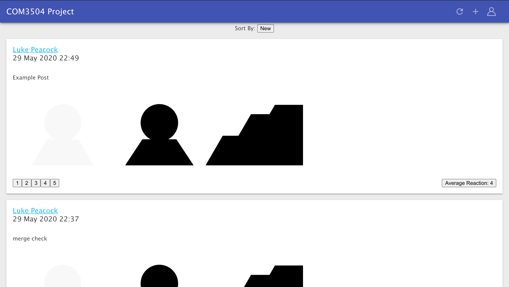


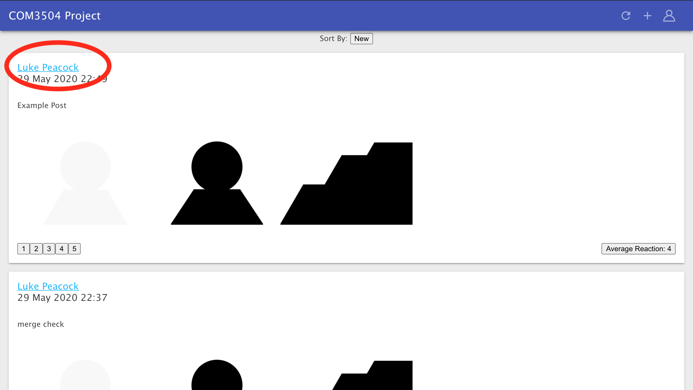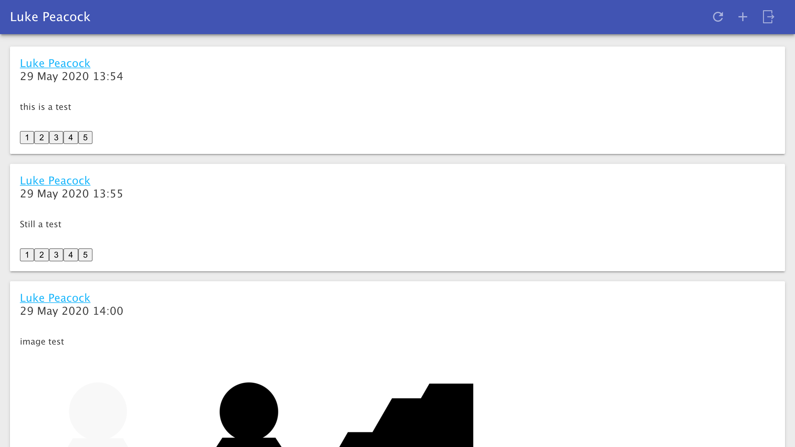

(Above left): viewing stories on the index page by newest first. (Bottom left): Clicking a user's name navigates to their profile. (Bottom right): viewing stories on a user's profile (always newest first).


To see the reactions to a story, click the `average reactions` button. This will open a dialog listing all users who have reacted and their reaction. If you wish to see a user's profile from this list, just click their name.

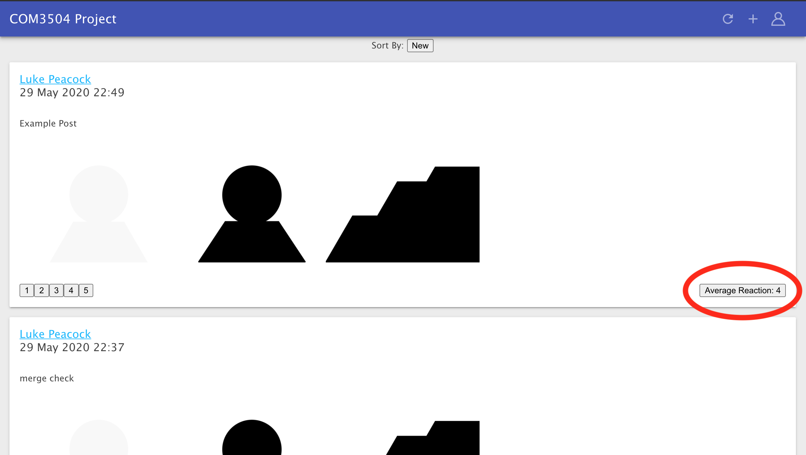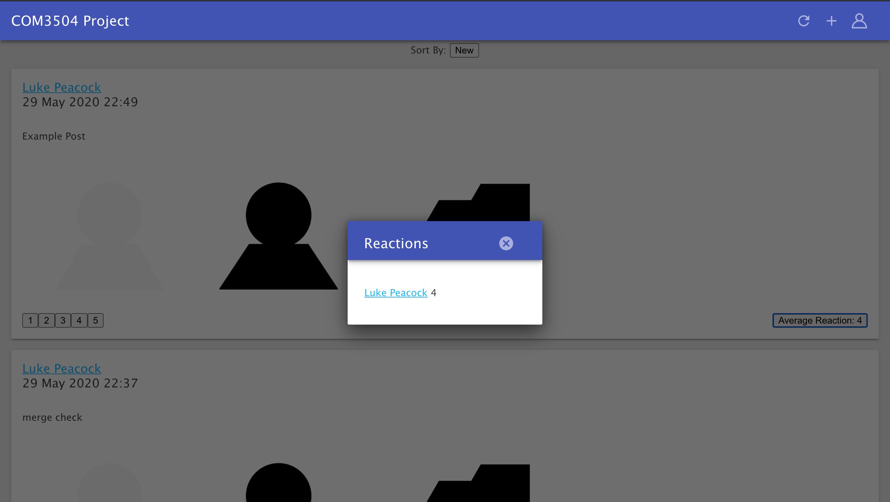

(Above left): The average reaction button, clicking will open the reactions pop-up. (Above right): The reactions pop-up for a story.


